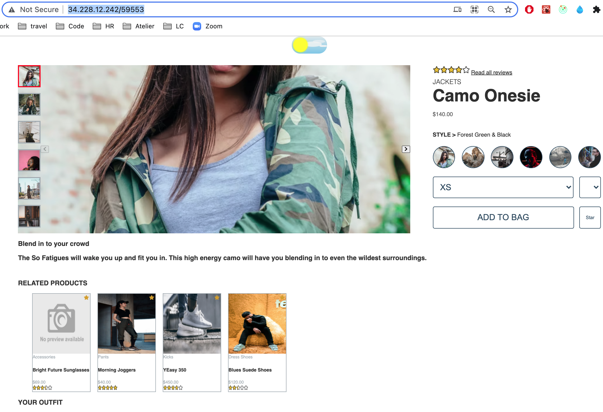
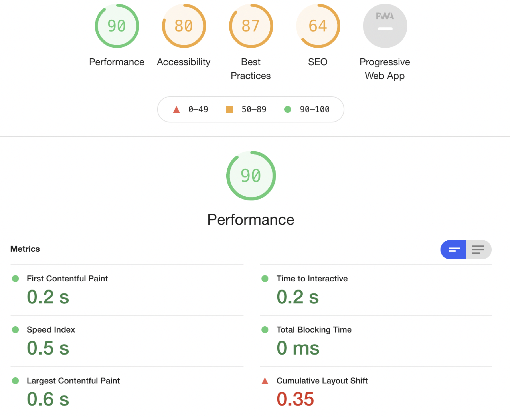

Project Atleier

This project is a redesign of a retail website that will leverage a React front end to interact with a pre-existing backend that can be accessed via API.

The front end redesign will be of the project detail page including, but not limited to:

1. Overview
   A) Project Information
   B) Style Selector
   C) Add to Cart
   D) Image Gallery
2. Ratings & Reviews
   A) Reviews List
   B) Individual Review Tile
   C) Sort Options
   D) Rating Breakdown (Filtering)
   E) Product Breakdown (Factors)
   F) Write New Review
   G) Keyword search - Low Priority
3. Questions & Answers
   A) Questions List
   B) Individual Question
   C) Search Questions
   D) More Answered Questions
   E) Add a Question
   F) Add an Answer Modal
4. Related Items & Comparison
   A) Related Product Cards
   B) List Behavior
   C) Related Products List
   D) Your Outfit List

When working on this app make sure to run npm install first.

It will be compiled by webpack with babel.
